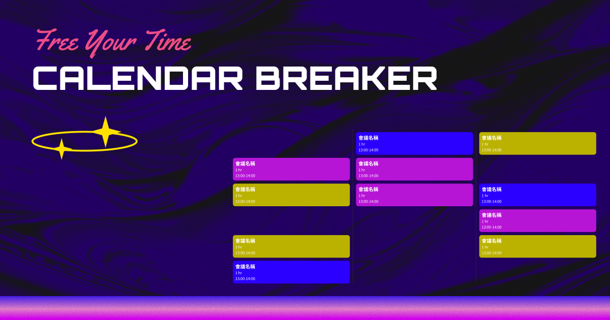

# Calendar Breakout - 擊破不需要的會議 🚀

一個充滿樂趣的打磚塊遊戲，讓你在虛擬世界中擊破那些煩人的會議！釋放你的工作壓力，重獲自由時光。

## 🎯 [立即遊玩 - Play Now!](https://kjohh.github.io/calendar-breakout/)



## 🎮 遊戲特色

### 💼 會議主題設計
- **真實會議場景**：模擬日常工作中的各種會議類型
- **隨機生成**：每次遊戲都有不同的會議安排
- **幽默元素**：擊破會議後的搞笑總結讓你會心一笑

### 🎯 遊戲玩法
- **經典打磚塊**：使用滑鼠或觸控控制橫桿
- **一擊必殺**：球掉落即遊戲結束，考驗你的反應力
- **統計追蹤**：記錄擊破的會議數量和重獲的自由時數
- **社群分享**：遊戲結束後可分享戰績到社群媒體

### 🎨 視覺設計
- **現代化 UI**：採用漸變色彩和玻璃質感設計
- **響應式佈局**：完美支援桌面和行動裝置
- **流暢動畫**：會議被擊破時的爆炸特效
- **沈浸式體驗**：全螢幕遊戲畫面

## 🚀 立即開始

### 線上遊玩
🚀 **[點擊這裡立即遊玩](https://kjohh.github.io/calendar-breakout/)**

或者下載後直接開啟 `index.html` 檔案即可開始遊戲！

### 本地部署
```bash
# 複製專案
git clone https://github.com/your-username/calendar-breakout.git

# 進入專案目錄
cd calendar-breakout

# 使用任何網頁伺服器開啟
# 例如使用 Python
python -m http.server 8000

# 或使用 Node.js
npx serve .
```

然後在瀏覽器中開啟 `http://localhost:8000`

## 🎮 操作方式

### 桌面版
- **滑鼠移動**：控制橫桿左右移動
- **自動開始**：球會自動開始彈跳

### 行動版
- **觸控滑動**：在螢幕上滑動控制橫桿
- **觸控優化**：防止誤觸和畫面滾動

## 📊 遊戲統計

遊戲會即時顯示：
- **重回自由時數**：擊破會議釋放的時間
- **擊破會議數**：成功消除的會議總數
- **遊戲時間**：本次遊戲持續時間

## 🛠️ 技術架構

- **純前端**：HTML5 + CSS3 + JavaScript
- **Canvas 繪圖**：流暢的球體移動動畫
- **DOM 操作**：動態會議磚塊生成
- **響應式設計**：CSS Grid 和 Flexbox 佈局
- **觸控支援**：行動裝置優化

## 📱 裝置支援

- ✅ 現代瀏覽器（Chrome, Firefox, Safari, Edge）
- ✅ 桌面電腦和筆記型電腦
- ✅ 平板電腦和智慧型手機
- ✅ iOS 和 Android 裝置

## 🎯 未來規劃

- [ ] 更多會議類型和主題
- [ ] 多關卡設計
- [ ] 排行榜系統
- [ ] 音效和背景音樂
- [ ] 會議室場景選擇
- 以上是AI瞎掰的，我有考慮讓大家連結自己的行事曆，但再說吧

## 🤝 貢獻指南

歡迎提交 Issue 和 Pull Request！

1. Fork 此專案
2. 建立你的功能分支 (`git checkout -b feature/AmazingFeature`)
3. 提交你的變更 (`git commit -m 'Add some AmazingFeature'`)
4. 推送到分支 (`git push origin feature/AmazingFeature`)
5. 開啟 Pull Request

## 📄 授權條款

此專案採用 MIT 授權條款 - 詳見 [LICENSE](LICENSE) 檔案

## 🎉 致謝

感謝所有在職場中遭受無效會議折磨的工作者們，這個遊戲獻給你們！

---

<div align="center">
  <p>為所有討厭無意義會議的人而製作 ❤️</p>
</div>
